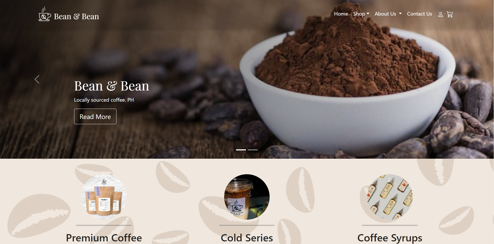
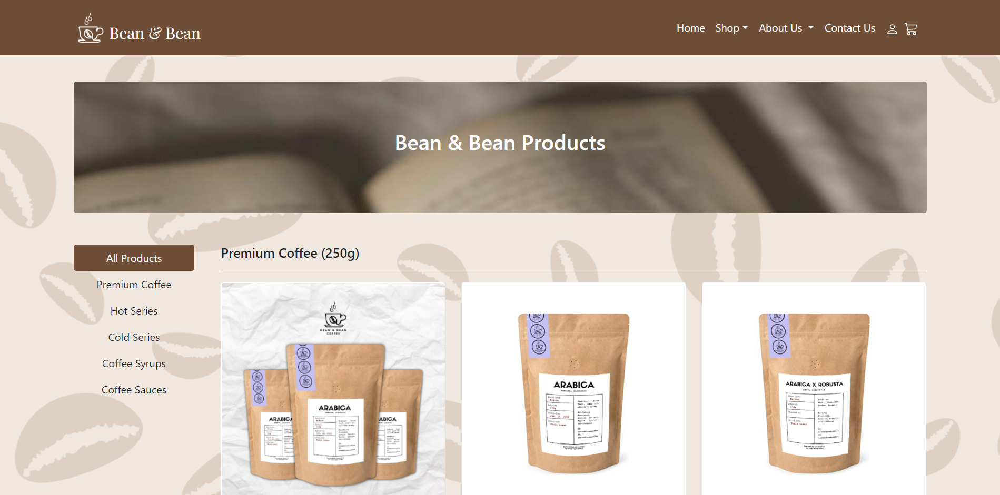
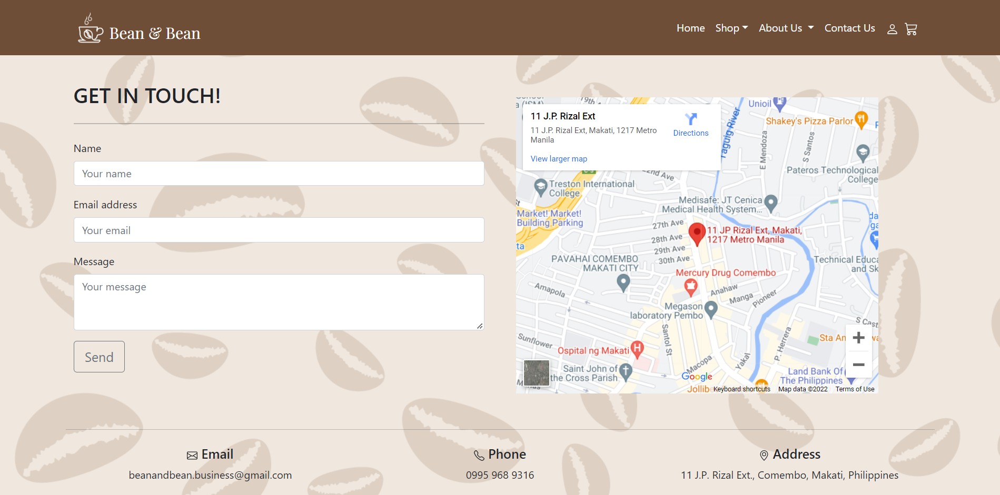
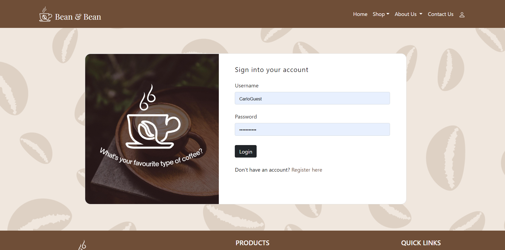

# Bean&Bean: Online Transaction Processing System
This repository is a project my group and I did for our course Software Engineering 1 & 2. The purpose of this project is to build an Online Transaction Processing System (OTPS) through a web application for our client, Bean&Bean. The said system will be used to manage product orders from customers to ease business transactions. OTPS will be used as a substitute for typical social platforms used as means of selling, buying, and ordering. Moreover, the system also aims to lessen, if not eliminate, the problems that the customers may face in ordering through social media platforms. A user-friendly web application will be developed to implement OTPS. Through this, the customers will be able to view the available products of Bean&Bean, order their desired coffee products, and track their placed orders. 

## Implementation
This project was mainly implemented using the java programming language. The group used NetBeans 8.2 as an IDE and hosted the project on the GlassFish Server 4.1.1 using Java EE 5. The pages were built using Java Servlet Pages and styled using CSS. SQL was used in order to set up the database of the system. The web application made use of the following libraries:
*  commons-codec-1.9
*  derbyclient
*  itextpdf-5.5.9
*  mysql-connector-java-5.1.34
*  simplecaptcha-1.2.1

However upon hosting the website on Heroku, the group converted the project into a maven project, which used Apache Tomcat 8.5 as its container. The group also migrated the database from MySQL to PostgreSQL, since we decided to use ElephantSQL as a dedicated database server. The resulting domain for the website can be found in here: 
*  <a href="https://bean-and-bean.herokuapp.com/"> https://bean-and-bean.herokuapp.com/ </a>

Please be noted that the products within the webiste are actual products from the Bean & Bean Coffee. However the client didn't provide the complete images of the product, so the group decided to use dummy pictures for the products.
 
## Features
*  Within the Bean&Bean website application, users can navigate through the site and see all the information and available products from the Bean & Bean company
*  Before users can order a product, they must first Log-in as customer to the website using a signed up account that has already completed the email verification process
*  In order to sign up a customer account, the user needs to input their information, answer the captcha correctly, and verify their email.
*  When the customers order through the website, they can get a proof-of-order per each order as a pdf file. They can also get their order history in the same format.
*  Customers can also write a review on the Bean & Bean company throuh the About us page
*  The Bean&Bean company is notified for every activity that goes through the website. The website application does this by emailing every order placed and every review made to the Bean&Bean company email
*  The owner of the company has an admin account that can be used to manage orders from the website application. The website offers an interface that allows the admin to organize the orders and set each of the order's status

## Pictures of the Website Application
*  The Landing page

*  The Shop page

*  The Contact Us page

*  The Login page

